# Podaci

Podaci su preuzeti sa sajta RIK-a "Rezultati po birackim mestima" (16-07-2020): https://www.rik.parlament.gov.rs/tekst/9386/ukupni-rezultati-izbora-za-narodne-poslanike-narodne-skupstine-2020-godine.php

# Analiza rezultata

Analiza rezultata je uradjena u R jeziku, koristeci R Markdown koji omogucuje reprodukciju analize. Kod koji je koriscen ce biti vidljiv u ovom dokumentu radi transparentnosti, a samim time i lakseg uocavanja gresaka. 


```r
require(tidyverse)
require(cowplot)

elections <- read_csv("izbori.csv")

head(elections)
```

<div data-pagedtable="false">
  <script data-pagedtable-source type="application/json">
{"columns":[{"label":["Okrug"],"name":[1],"type":["dbl"],"align":["right"]},{"label":["Naziv okruga"],"name":[2],"type":["chr"],"align":["left"]},{"label":["Opstina"],"name":[3],"type":["dbl"],"align":["right"]},{"label":["Naziv opstine"],"name":[4],"type":["chr"],"align":["left"]},{"label":["Biracko mesto"],"name":[5],"type":["dbl"],"align":["right"]},{"label":["Upisani biraci"],"name":[6],"type":["dbl"],"align":["right"]},{"label":["Primljeni"],"name":[7],"type":["dbl"],"align":["right"]},{"label":["Neupotrebljeni"],"name":[8],"type":["dbl"],"align":["right"]},{"label":["Glasali"],"name":[9],"type":["dbl"],"align":["right"]},{"label":["U glasackoj kutiji"],"name":[10],"type":["dbl"],"align":["right"]},{"label":["Nevazeci"],"name":[11],"type":["dbl"],"align":["right"]},{"label":["Vazeci"],"name":[12],"type":["dbl"],"align":["right"]},{"label":["Aleksandar Vucic"],"name":[13],"type":["dbl"],"align":["right"]},{"label":["Ivica Dacic"],"name":[14],"type":["dbl"],"align":["right"]},{"label":["Vojislav Seselj"],"name":[15],"type":["dbl"],"align":["right"]},{"label":["Istvan Pastor"],"name":[16],"type":["dbl"],"align":["right"]},{"label":["Aleksandar Sapic"],"name":[17],"type":["dbl"],"align":["right"]},{"label":["Gojko Zivkovic"],"name":[18],"type":["dbl"],"align":["right"]},{"label":["UDS"],"name":[19],"type":["dbl"],"align":["right"]},{"label":["Muamer Zukorlic"],"name":[20],"type":["dbl"],"align":["right"]},{"label":["Metla"],"name":[21],"type":["dbl"],"align":["right"]},{"label":["Milan Stamatovic"],"name":[22],"type":["dbl"],"align":["right"]},{"label":["SDA"],"name":[23],"type":["dbl"],"align":["right"]},{"label":["Zavetnici"],"name":[24],"type":["dbl"],"align":["right"]},{"label":["Narodni Blok"],"name":[25],"type":["dbl"],"align":["right"]},{"label":["PSG"],"name":[26],"type":["dbl"],"align":["right"]},{"label":["Suverenisti"],"name":[27],"type":["dbl"],"align":["right"]},{"label":["Ujedinjena Dolina"],"name":[28],"type":["dbl"],"align":["right"]},{"label":["Grupa Gradjana 1 od 5"],"name":[29],"type":["dbl"],"align":["right"]},{"label":["Nek Maske Spadnu"],"name":[30],"type":["dbl"],"align":["right"]},{"label":["Ruska Stranka\n"],"name":[31],"type":["dbl"],"align":["right"]},{"label":["Cedomir Jovanovic"],"name":[32],"type":["dbl"],"align":["right"]},{"label":["Levijatan"],"name":[33],"type":["dbl"],"align":["right"]}],"data":[{"1":"0","2":"Град Београд","3":"70092","4":"Барајево","5":"1","6":"655","7":"653","8":"319","9":"334","10":"334","11":"9","12":"325","13":"243","14":"34","15":"7","16":"1","17":"3","18":"19","19":"1","20":"1","21":"5","22":"1","23":"0","24":"5","25":"2","26":"1","27":"1","28":"0","29":"0","30":"1","31":"0","32":"0","33":"0"},{"1":"0","2":"Град Београд","3":"70092","4":"Барајево","5":"2","6":"1329","7":"1330","8":"725","9":"605","10":"605","11":"21","12":"584","13":"363","14":"86","15":"18","16":"0","17":"32","18":"16","19":"1","20":"0","21":"12","22":"4","23":"0","24":"10","25":"1","26":"13","27":"11","28":"0","29":"3","30":"1","31":"2","32":"2","33":"9"},{"1":"0","2":"Град Београд","3":"70092","4":"Барајево","5":"3","6":"578","7":"578","8":"319","9":"259","10":"259","11":"6","12":"253","13":"173","14":"19","15":"6","16":"0","17":"10","18":"13","19":"1","20":"0","21":"12","22":"1","23":"0","24":"4","25":"3","26":"0","27":"6","28":"2","29":"0","30":"0","31":"1","32":"0","33":"2"},{"1":"0","2":"Град Београд","3":"70092","4":"Барајево","5":"4","6":"706","7":"706","8":"346","9":"360","10":"360","11":"8","12":"352","13":"244","14":"44","15":"9","16":"1","17":"13","18":"13","19":"0","20":"0","21":"6","22":"0","23":"1","24":"10","25":"0","26":"4","27":"0","28":"0","29":"1","30":"0","31":"0","32":"0","33":"6"},{"1":"0","2":"Град Београд","3":"70092","4":"Барајево","5":"5","6":"734","7":"734","8":"380","9":"354","10":"354","11":"9","12":"345","13":"263","14":"40","15":"13","16":"0","17":"8","18":"7","19":"0","20":"0","21":"1","22":"2","23":"0","24":"1","25":"0","26":"2","27":"2","28":"0","29":"0","30":"0","31":"0","32":"0","33":"6"},{"1":"0","2":"Град Београд","3":"70092","4":"Барајево","5":"6","6":"830","7":"830","8":"454","9":"376","10":"376","11":"8","12":"368","13":"270","14":"30","15":"11","16":"0","17":"19","18":"8","19":"0","20":"0","21":"3","22":"1","23":"0","24":"5","25":"2","26":"3","27":"3","28":"0","29":"4","30":"0","31":"0","32":"2","33":"7"}],"options":{"columns":{"min":{},"max":[10]},"rows":{"min":[10],"max":[10]},"pages":{}}}
  </script>
</div>

# Izlaznost po okruzima


```r
izlaznost <- elections %>%
  group_by(`Naziv okruga`) %>%
  summarize(
    `Upisani biraci` = sum(`Upisani biraci`),
    `Primljeni` = sum(`Primljeni`),
    `Neupotrebljeni` = sum(`Neupotrebljeni`),
    `Glasali` = sum(`Glasali`),
    `U glasackoj kutiji` = sum(`U glasackoj kutiji`),
    `Nevazeci` = sum(`Nevazeci`),
    `Vazeci` = sum(`Vazeci`)
  ) %>%
  ungroup() %>%
  mutate(
    `Izlaznost` = `Glasali` / `Upisani biraci`,
    `Naziv okruga` = fct_reorder(`Naziv okruga`, `Izlaznost`),
    preko_50 = ifelse(`Izlaznost` >= 0.5, TRUE, FALSE)
  )

head(izlaznost)
```

<div data-pagedtable="false">
  <script data-pagedtable-source type="application/json">
{"columns":[{"label":["Naziv okruga"],"name":[1],"type":["fctr"],"align":["left"]},{"label":["Upisani biraci"],"name":[2],"type":["dbl"],"align":["right"]},{"label":["Primljeni"],"name":[3],"type":["dbl"],"align":["right"]},{"label":["Neupotrebljeni"],"name":[4],"type":["dbl"],"align":["right"]},{"label":["Glasali"],"name":[5],"type":["dbl"],"align":["right"]},{"label":["U glasackoj kutiji"],"name":[6],"type":["dbl"],"align":["right"]},{"label":["Nevazeci"],"name":[7],"type":["dbl"],"align":["right"]},{"label":["Vazeci"],"name":[8],"type":["dbl"],"align":["right"]},{"label":["Izlaznost"],"name":[9],"type":["dbl"],"align":["right"]},{"label":["preko_50"],"name":[10],"type":["lgl"],"align":["right"]}],"data":[{"1":"Борски округ","2":"119034","3":"118989","4":"61239","5":"57750","6":"57740","7":"1758","8":"55982","9":"0.4851555","10":"FALSE"},{"1":"Браничевски округ","2":"179528","3":"179479","4":"86591","5":"92888","6":"92862","7":"3527","8":"89335","9":"0.5174012","10":"TRUE"},{"1":"Град Београд","2":"1604376","3":"1607606","4":"993632","5":"613974","6":"613515","7":"20616","8":"592899","9":"0.3826871","10":"FALSE"},{"1":"Заводи за извршење заводских санкција","2":"8646","3":"8646","4":"1473","5":"7173","6":"7173","7":"182","8":"6991","9":"0.8296322","10":"TRUE"},{"1":"Зајечарски округ","2":"99975","3":"99933","4":"51589","5":"48344","6":"48318","7":"1712","8":"46606","9":"0.4835609","10":"FALSE"},{"1":"Западнобачки округ","2":"158970","3":"158713","4":"75112","5":"83601","6":"83582","7":"3315","8":"80267","9":"0.5258917","10":"TRUE"}],"options":{"columns":{"min":{},"max":[10]},"rows":{"min":[10],"max":[10]},"pages":{}}}
  </script>
</div>


```r
ggplot(
  izlaznost,
  aes(
    x = `Naziv okruga`,
    y = `Izlaznost`,
    fill = `preko_50`
  )
) +
  theme_cowplot(8) +
  geom_bar(stat = "identity", alpha = 0.8) +
  geom_hline(yintercept = 0.5, alpha = 0.5, linetype = "dashed") +
  coord_flip() +
  xlab(NULL) +
  theme(legend.position = "none") +
  scale_fill_manual(values = c("dark red", "dark grey"))
```

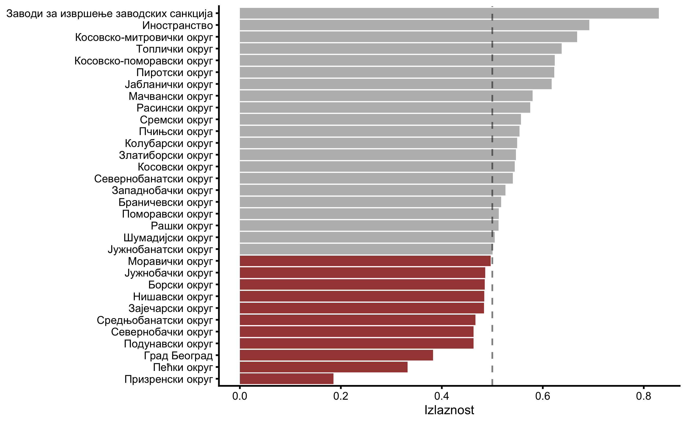

# Broj glasova po okruzima


```r
glasovi <- elections %>%
  gather(key = "Kandidat", value = "Broj glasova", -(1:12)) %>%
  group_by(`Naziv okruga`, `Kandidat`) %>%
  summarize(
    `Upisani biraci` = sum(`Upisani biraci`),
    `Primljeni` = sum(`Primljeni`),
    `Neupotrebljeni` = sum(`Neupotrebljeni`),
    `Glasali` = sum(`Glasali`),
    `U glasackoj kutiji` = sum(`U glasackoj kutiji`),
    `Nevazeci` = sum(`Nevazeci`),
    `Vazeci` = sum(`Vazeci`),
    `Broj glasova` = sum(`Broj glasova`)
  ) %>%
  ungroup() %>%
  mutate(
    `Procenat` = `Broj glasova` / `Vazeci`,
    preko_3_posto = ifelse(`Procenat` >= 0.03, TRUE, FALSE),
    threshold = `Vazeci` * 0.03)

head(glasovi)
```

<div data-pagedtable="false">
  <script data-pagedtable-source type="application/json">
{"columns":[{"label":["Naziv okruga"],"name":[1],"type":["chr"],"align":["left"]},{"label":["Kandidat"],"name":[2],"type":["chr"],"align":["left"]},{"label":["Upisani biraci"],"name":[3],"type":["dbl"],"align":["right"]},{"label":["Primljeni"],"name":[4],"type":["dbl"],"align":["right"]},{"label":["Neupotrebljeni"],"name":[5],"type":["dbl"],"align":["right"]},{"label":["Glasali"],"name":[6],"type":["dbl"],"align":["right"]},{"label":["U glasackoj kutiji"],"name":[7],"type":["dbl"],"align":["right"]},{"label":["Nevazeci"],"name":[8],"type":["dbl"],"align":["right"]},{"label":["Vazeci"],"name":[9],"type":["dbl"],"align":["right"]},{"label":["Broj glasova"],"name":[10],"type":["dbl"],"align":["right"]},{"label":["Procenat"],"name":[11],"type":["dbl"],"align":["right"]},{"label":["preko_3_posto"],"name":[12],"type":["lgl"],"align":["right"]},{"label":["threshold"],"name":[13],"type":["dbl"],"align":["right"]}],"data":[{"1":"Борски округ","2":"Aleksandar Sapic","3":"119034","4":"118989","5":"61239","6":"57750","7":"57740","8":"1758","9":"55982","10":"1847","11":"0.0329927477","12":"TRUE","13":"1679.46"},{"1":"Борски округ","2":"Aleksandar Vucic","3":"119034","4":"118989","5":"61239","6":"57750","7":"57740","8":"1758","9":"55982","10":"38843","11":"0.6938480226","12":"TRUE","13":"1679.46"},{"1":"Борски округ","2":"Cedomir Jovanovic","3":"119034","4":"118989","5":"61239","6":"57750","7":"57740","8":"1758","9":"55982","10":"630","11":"0.0112536172","12":"FALSE","13":"1679.46"},{"1":"Борски округ","2":"Gojko Zivkovic","3":"119034","4":"118989","5":"61239","6":"57750","7":"57740","8":"1758","9":"55982","10":"1540","11":"0.0275088421","12":"FALSE","13":"1679.46"},{"1":"Борски округ","2":"Grupa Gradjana 1 od 5","3":"119034","4":"118989","5":"61239","6":"57750","7":"57740","8":"1758","9":"55982","10":"473","11":"0.0084491444","12":"FALSE","13":"1679.46"},{"1":"Борски округ","2":"Istvan Pastor","3":"119034","4":"118989","5":"61239","6":"57750","7":"57740","8":"1758","9":"55982","10":"38","11":"0.0006787896","12":"FALSE","13":"1679.46"}],"options":{"columns":{"min":{},"max":[10]},"rows":{"min":[10],"max":[10]},"pages":{}}}
  </script>
</div>


```r
ggplot(
  glasovi,
  aes(
    x = `Kandidat`,
    y = `Broj glasova`,
    fill = `preko_3_posto`
  )
) +
  theme_cowplot(6) +
  geom_bar(stat = "identity", alpha = 0.8) +
  geom_hline(aes(yintercept = threshold), alpha = 0.5, linetype = "dashed") +
  coord_flip() +
  xlab(NULL) +
  ylab("Broj glasova (log10)") +
  facet_wrap(~`Naziv okruga`, scales = "free_x") +
  theme(legend.position = "none") +
  scale_fill_manual(values = c("dark red", "dark grey")) +
  scale_y_log10()
```

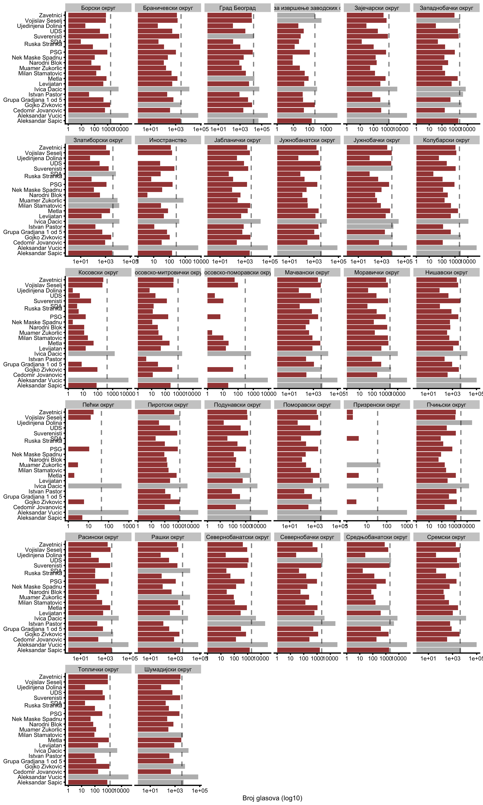


```r
ggplot(
  glasovi,
  aes(
    x = `Kandidat`,
    y = `Procenat`,
    fill = `preko_3_posto`
  )
) +
  theme_cowplot(5) +
  geom_bar(stat = "identity", alpha = 0.8) +
  geom_hline(yintercept = 0.03, alpha = 0.5, linetype = "dashed") +
  coord_flip() +
  xlab(NULL) +
  ylab("Procenat broja glasova") +
  facet_wrap(~`Naziv okruga`, scales = "free_x") +
  theme(legend.position = "none") +
  scale_fill_manual(values = c("dark red", "dark grey")) 
```

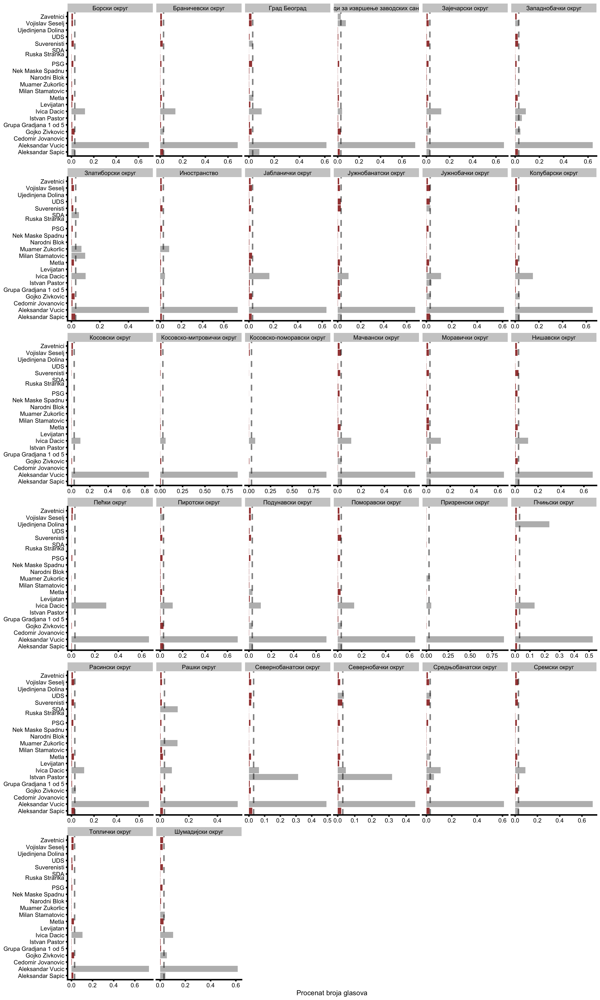

# Analiza poslednje decimale broja glasova

Ova analiza je bazirana na sledecem radu:

Beber, B., & Scacco, A. (2012). What the Numbers Say: A Digit-Based Test for Election Fraud. Political Analysis, 20(2), 211-234. doi:10.1093/pan/mps003

**Abstract**
>Is it possible to detect manipulation by looking only at electoral returns? Drawing on work in psychology, we exploit individuals' biases in generating numbers to highlight suspicious digit patterns in reported vote counts. First, we show that fair election procedures produce returns where last digits occur with equal frequency, but laboratory experiments indicate that individuals tend to favor some numerals over others, even when subjects have incentives to properly randomize. Second, individuals underestimate the likelihood of digit repetition in sequences of random integers, so we should observe relatively few instances of repeated numbers in manipulated vote tallies. Third, laboratory experiments demonstrate a preference for pairs of adjacent digits, which suggests that such pairs should be abundant on fraudulent return sheets. Fourth, subjects avoid pairs of distant numerals, so those should appear with lower frequency on tainted returns. We test for deviations in digit patterns using data from Sweden's 2002 parliamentary elections, Senegal's 2000 and 2007 presidential elections, and previously unavailable results from Nigeria's 2003 presidential election. In line with observers' expectations, we find substantial evidence that manipulation occurred in Nigeria as well as in Senegal in 2007.


```r
require(stringr)

decimale <- elections %>%
  gather(key = "Kandidat", value = "Broj glasova", -(1:12)) %>%
  mutate(
    last_digit = factor(str_sub(`Broj glasova`, -1, -1))
  )

head(decimale)
```

<div data-pagedtable="false">
  <script data-pagedtable-source type="application/json">
{"columns":[{"label":["Okrug"],"name":[1],"type":["dbl"],"align":["right"]},{"label":["Naziv okruga"],"name":[2],"type":["chr"],"align":["left"]},{"label":["Opstina"],"name":[3],"type":["dbl"],"align":["right"]},{"label":["Naziv opstine"],"name":[4],"type":["chr"],"align":["left"]},{"label":["Biracko mesto"],"name":[5],"type":["dbl"],"align":["right"]},{"label":["Upisani biraci"],"name":[6],"type":["dbl"],"align":["right"]},{"label":["Primljeni"],"name":[7],"type":["dbl"],"align":["right"]},{"label":["Neupotrebljeni"],"name":[8],"type":["dbl"],"align":["right"]},{"label":["Glasali"],"name":[9],"type":["dbl"],"align":["right"]},{"label":["U glasackoj kutiji"],"name":[10],"type":["dbl"],"align":["right"]},{"label":["Nevazeci"],"name":[11],"type":["dbl"],"align":["right"]},{"label":["Vazeci"],"name":[12],"type":["dbl"],"align":["right"]},{"label":["Kandidat"],"name":[13],"type":["chr"],"align":["left"]},{"label":["Broj glasova"],"name":[14],"type":["dbl"],"align":["right"]},{"label":["last_digit"],"name":[15],"type":["fctr"],"align":["left"]}],"data":[{"1":"0","2":"Град Београд","3":"70092","4":"Барајево","5":"1","6":"655","7":"653","8":"319","9":"334","10":"334","11":"9","12":"325","13":"Aleksandar Vucic","14":"243","15":"3"},{"1":"0","2":"Град Београд","3":"70092","4":"Барајево","5":"2","6":"1329","7":"1330","8":"725","9":"605","10":"605","11":"21","12":"584","13":"Aleksandar Vucic","14":"363","15":"3"},{"1":"0","2":"Град Београд","3":"70092","4":"Барајево","5":"3","6":"578","7":"578","8":"319","9":"259","10":"259","11":"6","12":"253","13":"Aleksandar Vucic","14":"173","15":"3"},{"1":"0","2":"Град Београд","3":"70092","4":"Барајево","5":"4","6":"706","7":"706","8":"346","9":"360","10":"360","11":"8","12":"352","13":"Aleksandar Vucic","14":"244","15":"4"},{"1":"0","2":"Град Београд","3":"70092","4":"Барајево","5":"5","6":"734","7":"734","8":"380","9":"354","10":"354","11":"9","12":"345","13":"Aleksandar Vucic","14":"263","15":"3"},{"1":"0","2":"Град Београд","3":"70092","4":"Барајево","5":"6","6":"830","7":"830","8":"454","9":"376","10":"376","11":"8","12":"368","13":"Aleksandar Vucic","14":"270","15":"0"}],"options":{"columns":{"min":{},"max":[10]},"rows":{"min":[10],"max":[10]},"pages":{}}}
  </script>
</div>

### Analiza poslednje decimale ukupno


```r
table(decimale$last_digit)
#> 
#>     0     1     2     3     4     5     6     7     8     9 
#> 73494 27723 17305 12881 10551  8892  7674  6872  6149  5552
```


```r
ggplot(
  decimale,
  aes(x = last_digit)
) +
  theme_cowplot(8) +
  geom_bar(aes(y = (..count..)/sum(..count..))) +
  geom_hline(yintercept = 0.1, alpha = 0.5, linetype = "dashed") +
  xlab("Poslednja decimala") +
  ylab("Proporcija")
```


Kada se izbace rezultati gde je broj glasova 0:


```r
ggplot(
  filter(decimale, `Broj glasova` > 0),
  aes(x = last_digit)
) +
  theme_cowplot(8) +
  geom_bar(aes(y = (..count..)/sum(..count..))) +
  geom_hline(yintercept = 0.1, alpha = 0.5) +
  geom_hline(yintercept = 0.11, alpha = 0.5, linetype = "dashed") +
  geom_hline(yintercept = 0.09, alpha = 0.5, linetype = "dashed") +
  xlab("Poslednja decimala") +
  ylab("Proporcija")
```

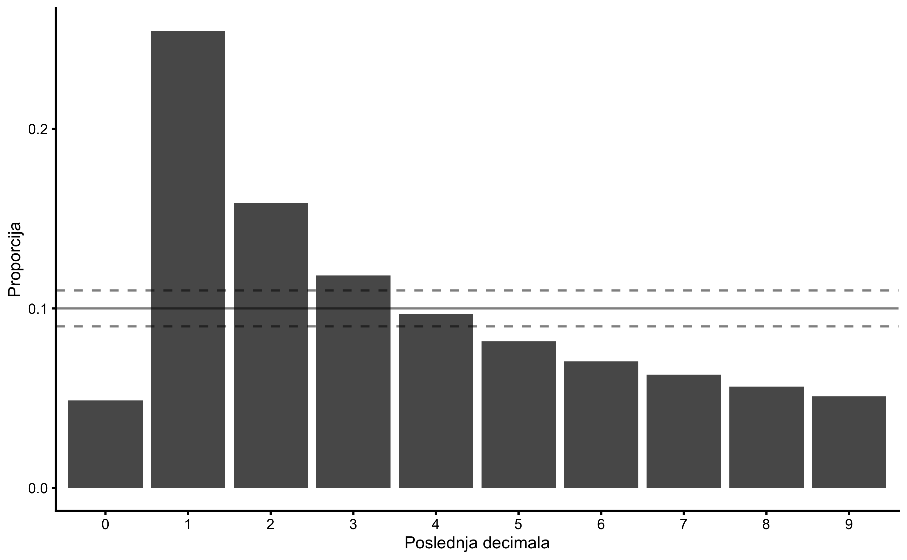

Kada se izbace rezultati gde je broj glasova manji ili jednak 10:


```r
ggplot(
  filter(decimale, `Broj glasova` >= 10),
  aes(x = last_digit)
) +
  theme_cowplot(8) +
  geom_bar(aes(y = (..count..)/sum(..count..))) +
  geom_hline(yintercept = 0.1, alpha = 0.5) +
  geom_hline(yintercept = 0.11, alpha = 0.5, linetype = "dashed") +
  geom_hline(yintercept = 0.09, alpha = 0.5, linetype = "dashed") +
  xlab("Poslednja decimala") +
  ylab("Proporcija")
```

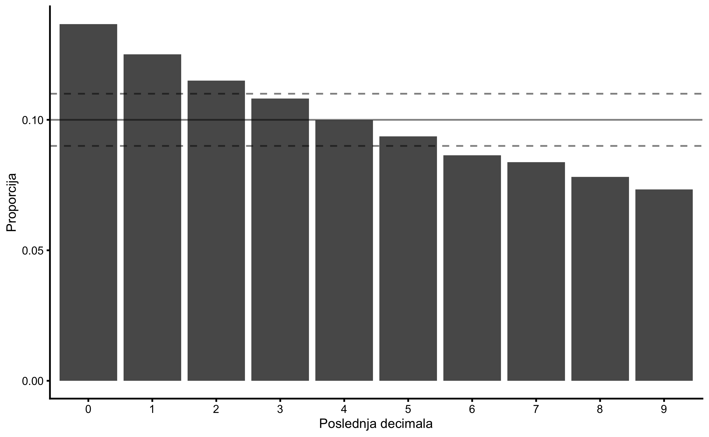

Kada se izbace rezultati gde je broj glasova manji ili jednak 100:


```r
ggplot(
  filter(decimale, `Broj glasova` >= 100),
  aes(x = last_digit)
) +
  theme_cowplot(8) +
  geom_bar(aes(y = (..count..)/sum(..count..))) +
  geom_hline(yintercept = 0.1, alpha = 0.5) +
  geom_hline(yintercept = 0.11, alpha = 0.5, linetype = "dashed") +
  geom_hline(yintercept = 0.09, alpha = 0.5, linetype = "dashed") +
  xlab("Poslednja decimala") +
  ylab("Proporcija")
```

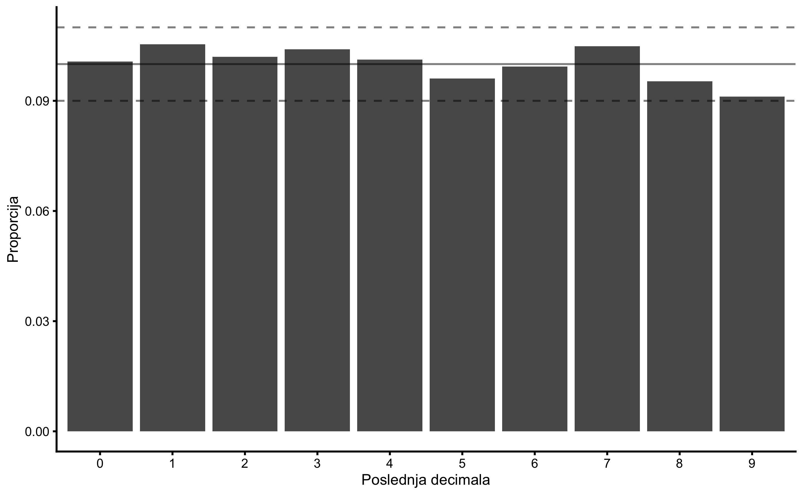


### Analiza poslednje decimale po kandidatu


```r
table(decimale$Kandidat, decimale$last_digit)
#>                        
#>                            0    1    2    3    4    5    6    7    8    9
#>   Aleksandar Sapic      1544 1176 1016  879  783  731  651  609  544  500
#>   Aleksandar Vucic       841  881  852  858  840  806  856  856  836  807
#>   Cedomir Jovanovic     4608 1711  914  519  320  166   85   67   24   19
#>   Gojko Zivkovic        1423 1050  944  845  800  770  737  689  615  560
#>   Grupa Gradjana 1 od 5 3348 1398  976  706  592  422  374  259  200  158
#>   Istvan Pastor         4878 1566  659  362  263  188  158  131  106  122
#>   Ivica Dacic           1009  881  895  898  830  827  779  808  761  745
#>   Levijatan             3235 1382  949  739  582  471  358  304  232  181
#>   Metla                 1960 1222 1002  836  747  659  604  498  477  428
#>   Milan Stamatovic      3479 1592  998  738  512  357  241  207  186  123
#>   Muamer Zukorlic       4936 1921  753  319  168  106   81   57   49   43
#>   Narodni Blok          5563 1463  643  283  191  103   75   35   42   35
#>   Nek Maske Spadnu      5127 1500  804  430  229  142   82   60   42   17
#>   PSG                   2602 1262  966  745  678  565  474  429  376  336
#>   Ruska Stranka\n       5358 1758  666  308  152   83   46   28   20   14
#>   SDA                   7081  902  193   61   28   37   35   37   32   27
#>   Suverenisti           2236 1201  941  780  685  611  557  542  451  429
#>   UDS                   3522 1523  911  734  516  371  292  213  197  154
#>   Ujedinjena Dolina     7263  943  132   31   13    8   15   10    7   11
#>   Vojislav Seselj       1364 1139 1072  917  909  829  616  575  520  492
#>   Zavetnici             2117 1252 1019  893  713  640  558  458  432  351
```


```r
ggplot(
  decimale,
  aes(x = last_digit)
) +
  theme_cowplot(8) +
  geom_bar(aes(y = (..count..))) +
  facet_wrap(~`Kandidat`, scales = "free_y") +
  xlab("Poslednja decimala") +
  ylab("Broj pojavljivanja")
```


Kada se izbace rezultati gde je broj glasova 0:


```r
ggplot(
  filter(decimale, `Broj glasova` > 0),
  aes(x = last_digit)
) +
  theme_cowplot(8) +
  geom_bar(aes(y = (..count..))) +
  facet_wrap(~`Kandidat`, scales = "free_y") +
  xlab("Poslednja decimala") +
  ylab("Broj pojavljivanja")
```

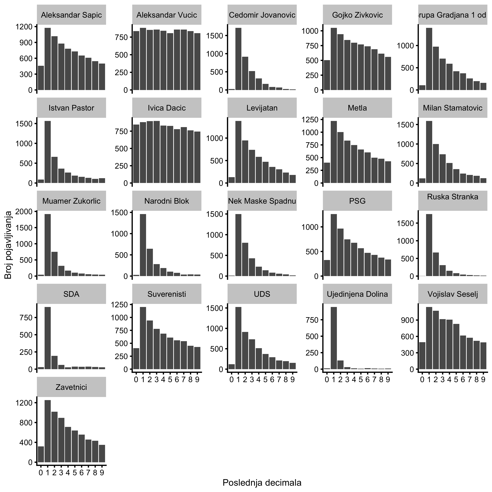

Kada se izbace rezultati gde je broj glasova manji ili jednak 10:


```r
ggplot(
  filter(decimale, `Broj glasova` >= 10),
  aes(x = last_digit)
) +
  theme_cowplot(8) +
  geom_bar(aes(y = (..count..))) +
  facet_wrap(~`Kandidat`, scales = "free_y") +
  xlab("Poslednja decimala") +
  ylab("Broj pojavljivanja")
```

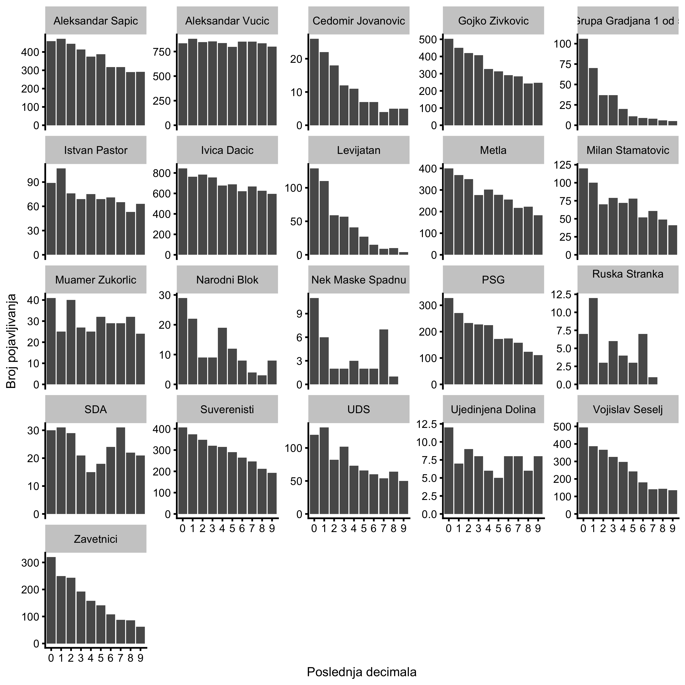

Kada se izbace rezultati gde je broj glasova manji ili jednak 100:


```r
ggplot(
  filter(decimale, `Broj glasova` >= 100),
  aes(x = last_digit)
) +
  theme_cowplot(8) +
  geom_bar(aes(y = (..count..))) +
  facet_wrap(~`Kandidat`, scales = "free_y") +
  xlab("Poslednja decimala") +
  ylab("Broj pojavljivanja")
```


### Analiza poslednje decimale po okrugu


```r
ggplot(
  decimale,
  aes(x = last_digit)
) +
  theme_cowplot(8) +
  geom_bar(aes(y = (..count..))) +
  facet_wrap(~`Naziv okruga`, scales = "free_y") +
  xlab("Poslednja decimala") +
  ylab("Broj pojavljivanja")
```

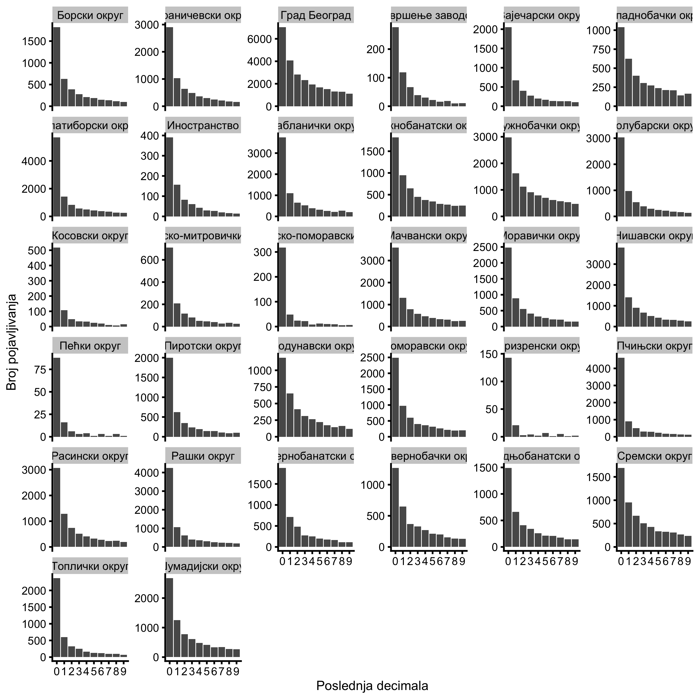


Kada se izbace rezultati gde je broj glasova 0:


```r
ggplot(
  filter(decimale, `Broj glasova` > 0),
  aes(x = last_digit)
) +
  theme_cowplot(8) +
  geom_bar(aes(y = (..count..))) +
  facet_wrap(~`Naziv okruga`, scales = "free_y") +
  xlab("Poslednja decimala") +
  ylab("Broj pojavljivanja")
```

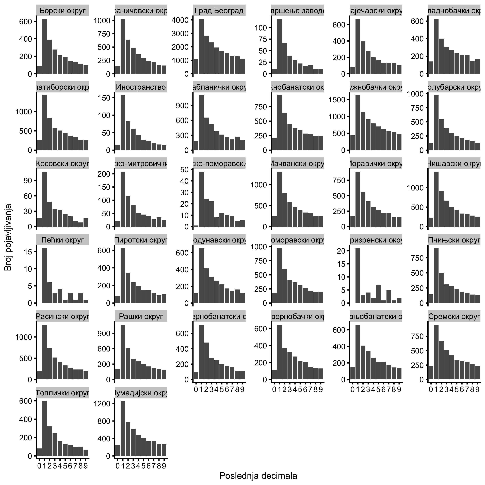

Kada se izbace rezultati gde je broj glasova manji ili jednak 10:


```r
ggplot(
  filter(decimale, `Broj glasova` >= 10),
  aes(x = last_digit)
) +
  theme_cowplot(8) +
  geom_bar(aes(y = (..count..))) +
  facet_wrap(~`Naziv okruga`, scales = "free_y") +
  xlab("Poslednja decimala") +
  ylab("Broj pojavljivanja")
```

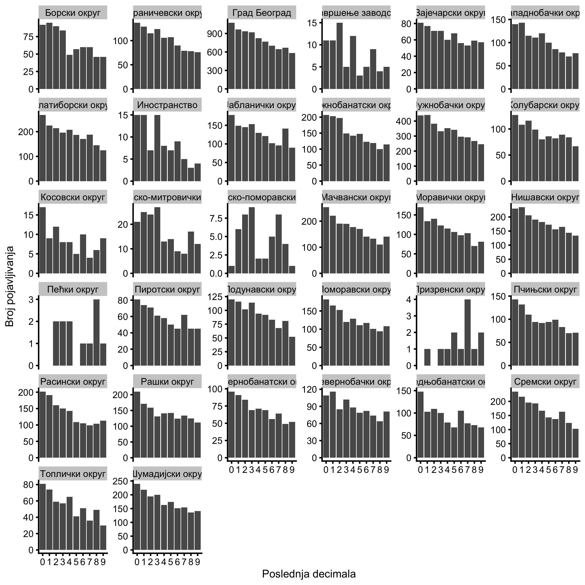

Kada se izbace rezultati gde je broj glasova manji ili jednak 100:


```r
ggplot(
  filter(decimale, `Broj glasova` >= 100),
  aes(x = last_digit)
) +
  theme_cowplot(8) +
  geom_bar(aes(y = (..count..))) +
  facet_wrap(~`Naziv okruga`, scales = "free_y") +
  xlab("Poslednja decimala") +
  ylab("Broj pojavljivanja")
```

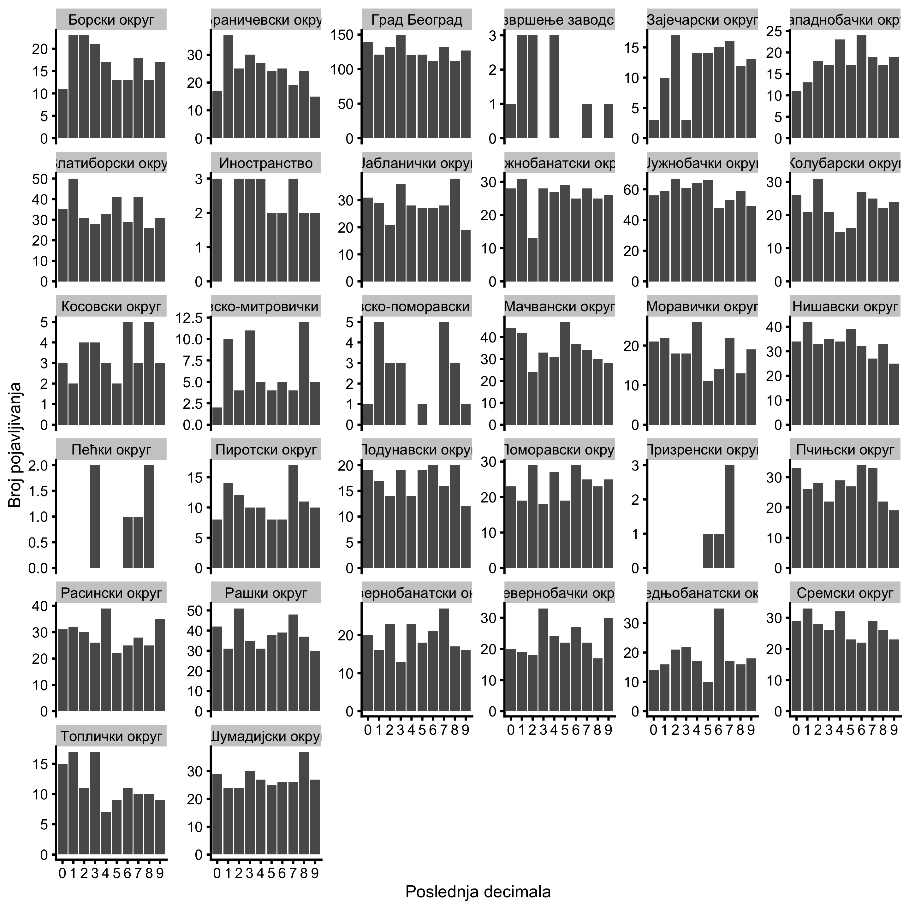
